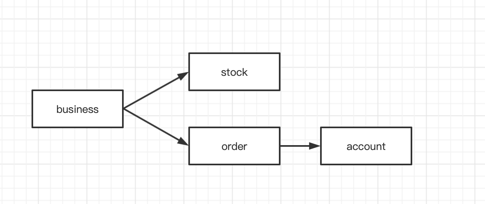
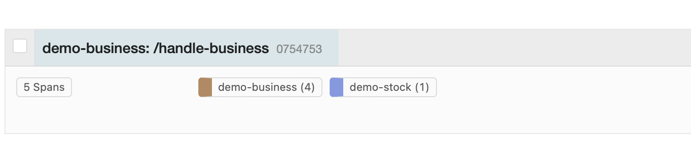

A demo for https://github.com/open-telemetry/opentelemetry-java-instrumentation/issues/7520

There are four dubbo services, their relationship is 


I use opentelemetry java agent to capture traces to Jaeger, and here are the vm options 
```
-javaagent:/Users/wade/Downloads/opentelemetry-javaagent-1.21.0.jar
-Dotel.traces.exporter=jaeger
-Dotel.exporter.jaeger.endpoint=http://localhost:14250
-Dotel.javaagent.debug=true
-Dotel.service.name=demo-xxx
```
Request url is http://localhost:9083/handle-business
The trace will break when consumering apache dubbo methods continuously.
Here are the snapshot from Jaeger UI.We can see the dubbo client trace are not fully captured. 


